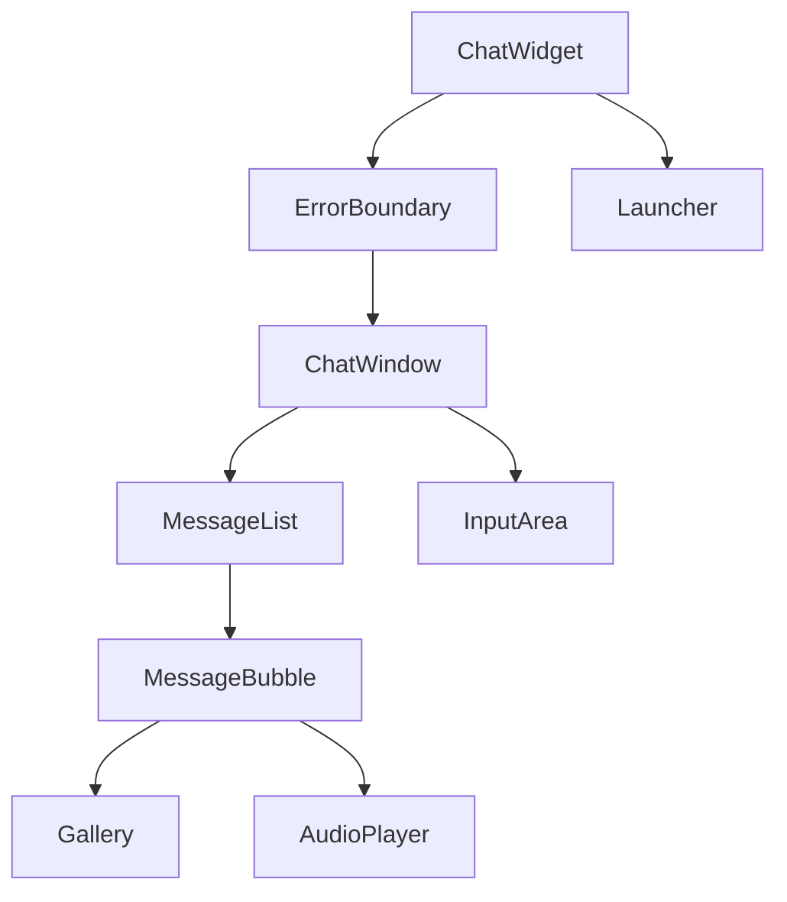

# 🏗️ Arquitectura del Chat Widget

## 📋 Índice

1. [Visión General](#visión-general)
2. [Principios SOLID Aplicados](#principios-solid-aplicados)
3. [Estructura de Componentes](#estructura-de-componentes)
4. [Flujo de Datos](#flujo-de-datos)
5. [Hooks Personalizados](#hooks-personalizados)
6. [Utilidades](#utilidades)
7. [Manejo de Errores](#manejo-de-errores)
8. [Rendimiento](#rendimiento)
9. [Seguridad](#seguridad)
10. [Testing](#testing)

---

## Visión General

El Chat Widget es una aplicación React moderna construida con principios SOLID, diseñada para ser:

- **Modular**: Componentes independientes y reutilizables
- **Escalable**: Soporta virtualización para miles de mensajes
- **Seguro**: Validación de entrada y sanitización de Markdown
- **Accesible**: WCAG compliant con soporte de screen readers
- **Performante**: Optimizaciones de throttle, debounce y lazy loading

### Stack Tecnológico

```
React 18.2.0          → Biblioteca UI
TypeScript 5.9.3      → Type safety
Vite 5.4.21           → Build tool
Socket.IO Client      → WebSocket bidireccional
Zod 3.x               → Runtime validation
TailwindCSS           → Styling
Framer Motion         → Animaciones
@tanstack/react-virtual → Virtualización de listas
```

---

## Principios SOLID Aplicados

### 1. Single Responsibility Principle (SRP)

Cada módulo tiene una única razón para cambiar:

| Módulo | Responsabilidad |
|--------|----------------|
| `useChatSocket.ts` | Gestión de conexión WebSocket |
| `useChatState.ts` | Estado global del chat |
| `logger.ts` | Logging centralizado |
| `performance.ts` | Optimizaciones de rendimiento |
| `useFocusTrap.ts` | Accesibilidad del teclado |
| `deviceId.ts` | Generación de UUID persistente |

**Ejemplo**:
```typescript
// ❌ Violación SRP: El componente hace demasiadas cosas
function ChatWidget() {
  const [socket, setSocket] = useState()
  const [messages, setMessages] = useState([])
  // ... lógica de socket, estado, UI, animaciones, etc.
}

// ✅ Aplicando SRP: Separación de responsabilidades
function ChatWidget() {
  const socket = useChatSocket()      // ← Responsable solo de WebSocket
  const { state, actions } = useChatState() // ← Responsable solo del estado
  // ... solo lógica de composición UI
}
```

### 2. Open/Closed Principle (OCP)

Extensible sin modificar código existente:

- **Temas personalizados**: Sistema de theming permite extender sin modificar componentes
- **Tipos de mensaje**: Union types permiten agregar nuevos tipos sin cambiar MessageBubble
- **Plugins de Markdown**: rehype-sanitize extensible mediante schema personalizado

**Ejemplo**:
```typescript
// ✅ Extensible mediante props, no requiere modificar componente
<ChatWidget
  theme={{
    primaryColor: '#FF6B6B',
    darkMode: true,
    customCSS: '...', // ← Extender estilos sin tocar el código fuente
  }}
/>
```

### 3. Liskov Substitution Principle (LSP)

Los subtipos son intercambiables:

```typescript
// Todos los tipos de mensaje implementan ChatMessage base
type ChatMessage = 
  | TextMessage 
  | ImageMessage 
  | AudioMessage 
  | LocationMessage

// MessageBubble acepta cualquier ChatMessage sin romper
function MessageBubble({ message }: { message: ChatMessage }) {
  // Discriminated union garantiza type safety
  switch (message.type) {
    case 'text': return <TextBubble {...message} />
    case 'image': return <ImageBubble {...message} />
    // ...
  }
}
```

### 4. Interface Segregation Principle (ISP)

Interfaces pequeñas y específicas:

```typescript
// ❌ Interfaz gorda: obliga a implementar todo
interface MegaLogger {
  log(msg: string): void
  warn(msg: string): void
  error(msg: string): void
  debug(msg: string): void
  info(msg: string): void
  trace(msg: string): void
  fatal(msg: string): void
}

// ✅ Interfaz segregada: solo lo necesario
interface Logger {
  log(msg: string): void
  warn(msg: string): void
  error(msg: string): void
}

// Componentes solo dependen de Logger, no de implementación completa
```

### 5. Dependency Inversion Principle (DIP)

Depender de abstracciones, no de concreciones:

```typescript
// ❌ Dependencia directa de implementación
function MyComponent() {
  console.log('Hello') // ← Acoplado a console
}

// ✅ Dependencia de abstracción
import { logger } from './utils/logger'
function MyComponent() {
  logger.log('Hello') // ← Usa abstracción Logger
}

// En tests:
const mockLogger = { log: vi.fn(), warn: vi.fn(), error: vi.fn() }
```

---

## Estructura de Componentes

```
ChatWidget (root)
├── ErrorBoundary
│   └── ChatWindow
│       ├── MessageList (virtualizado si >100 mensajes)
│       │   ├── MessageBubble (x N)
│       │   │   ├── TextContent
│       │   │   ├── Gallery (imágenes)
│       │   │   └── AudioPlayer
│       │   └── TypingIndicator
│       └── InputArea
│           ├── TextInput
│           ├── AttachButton
│           └── SendButton
└── Launcher
    └── Avatar animado
```

### Relaciones de Componentes



---

## Flujo de Datos

### Estado Global (Redux-like reducer)

```typescript
// Definición del estado
interface ChatState {
  messages: ChatMessage[]
  isOpen: boolean
  isTyping: boolean
  sessionId: string
  unreadCount: number
}

// Acciones disponibles
type ChatAction =
  | { type: 'ADD_MESSAGE'; payload: ChatMessage }
  | { type: 'TOGGLE_WINDOW' }
  | { type: 'SET_TYPING'; payload: boolean }
  | { type: 'RESTORE_SESSION'; payload: ChatState }
```

### Flujo de un Mensaje

```
┌─────────────┐
│   Usuario   │
│ escribe "X" │
└──────┬──────┘
       │
       ▼
┌─────────────────────┐
│   InputArea         │
│ onSendMessage("X")  │
└──────┬──────────────┘
       │
       ▼
┌──────────────────────────────┐
│   ChatWidget                 │
│ 1. Optimistic Update (local) │
│ 2. socket.sendMessage("X")   │
└──────┬───────────────────────┘
       │
       ▼
┌─────────────────────┐
│  useChatSocket      │
│ - Valida offline    │
│ - Queue si no hay ⚡│
│ - Emite a servidor  │
└──────┬──────────────┘
       │
       ▼
┌─────────────────────┐
│   Servidor          │
│ Procesa y responde  │
└──────┬──────────────┘
       │
       ▼
┌─────────────────────┐
│  useChatSocket      │
│ - Recibe respuesta  │
│ - Valida con Zod    │
│ - Sanitiza Markdown │
└──────┬──────────────┘
       │
       ▼
┌─────────────────────┐
│  useChatState       │
│ actions.addMessage()│
└──────┬──────────────┘
       │
       ▼
┌─────────────────────┐
│   MessageList       │
│ Re-render optimized │
└─────────────────────┘
```

---

## Hooks Personalizados

### useChatSocket

**Responsabilidad**: Gestión de WebSocket con reconexión automática

**Features**:
- ✅ Validación de payloads con Zod
- ✅ Cola de mensajes offline (flushQueue on reconnect)
- ✅ Throttle de eventos typing (250ms)
- ✅ Sanitización de Markdown (rehype-sanitize)

**API**:
```typescript
const socket = useChatSocket({
  serverUrl: 'ws://localhost:3000',
  deviceId: 'abc-123',
  onMessageReceived: (msg) => actions.addMessage(msg),
  onTypingChange: (isTyping) => actions.setTyping(isTyping),
})

// Métodos
socket.sendMessage(content, type)
socket.disconnect()

// Estado
socket.isConnected // boolean
socket.isTyping // boolean
```

### useChatState

**Responsabilidad**: Estado global + persistencia localStorage

**Features**:
- ✅ Reducer pattern con acciones tipadas
- ✅ Debounced save a localStorage (500ms)
- ✅ Hydration segura para SSR

**API**:
```typescript
const { state, actions } = useChatState()

// Estado
state.messages       // ChatMessage[]
state.isOpen         // boolean
state.unreadCount    // number

// Acciones
actions.addMessage(msg)
actions.toggleWindow()
actions.markAllRead()
actions.restoreSession(savedState)
```

### useFocusTrap

**Responsabilidad**: Accesibilidad de teclado en modals

**Features**:
- ✅ Captura Tab/Shift+Tab dentro del contenedor
- ✅ Restaura focus al cerrar
- ✅ Soporte Escape key

**API**:
```typescript
const dialogRef = useFocusTrap({
  enabled: isOpen,
  onEscape: () => setIsOpen(false),
})

<div ref={dialogRef} role="dialog" />
```

### useDynamicHeight

**Responsabilidad**: Ajuste de altura en móvil con teclado virtual

**Features**:
- ✅ Usa visualViewport API
- ✅ Fallback a window.innerHeight

**API**:
```typescript
const chatHeight = useDynamicHeight()
<div style={{ height: chatHeight }} />
```

---

## Utilidades

### logger.ts

Logging centralizado con flag DEBUG:

```typescript
import { logger } from './utils/logger'

logger.log('Info message')      // Solo en dev
logger.warn('Warning')          // Solo en dev
logger.error('Error', err)      // Solo en dev

// En producción:
// window.DEBUG = true  ← Habilita logs
```

### performance.ts

Optimizaciones reutilizables:

```typescript
import { throttle, debounce, memoize } from './utils/performance'

// Throttle: limitar frecuencia de ejecución
const handleScroll = throttle(() => {
  console.log('Scrolling...')
}, 250) // Max 1 ejecución cada 250ms

// Debounce: esperar a que el usuario termine
const handleSearch = debounce((query) => {
  api.search(query)
}, 500) // Ejecuta 500ms después del último cambio

// Memoize: cachear resultados costosos
const expensiveCalc = memoize((n) => {
  return fibonacci(n)
})
```

### deviceId.ts

Generación de UUID persistente:

```typescript
import { getDeviceId } from './utils/deviceId'

const id = getDeviceId() // ← Siempre el mismo por browser
```

---

## Manejo de Errores

### ErrorBoundary

Captura errores de React en componentes hijos:

```tsx
<ErrorBoundary
  fallback={<div>Error personalizado</div>}
  onError={(error, info) => analytics.trackError(error)}
>
  <ChatWindow />
</ErrorBoundary>
```

### Validación de Socket con Zod

```typescript
const BotMessageSchema = z.object({
  id: z.string(),
  type: z.enum(['text', 'image', 'audio', 'location']),
  sender: z.literal('bot'),
  timestamp: z.coerce.date(),
  content: z.string().optional(),
  // ...
})

// Uso
const result = BotMessageSchema.safeParse(payload)
if (!result.success) {
  logger.error('Invalid message:', result.error)
  return null // ← Rechaza mensajes malformados
}
```

---

## Rendimiento

### Virtualización de Listas

**Problema**: Renderizar 1000+ mensajes degrada performance

**Solución**: @tanstack/react-virtual

```typescript
// Activar solo si hay muchos mensajes
const shouldVirtualize = messages.length > 100

const virtualizer = useVirtualizer({
  count: messages.length,
  getScrollElement: () => containerRef.current,
  estimateSize: () => 80, // Altura estimada por mensaje
  overscan: 5,            // Pre-renderizar 5 items extra
  enabled: shouldVirtualize,
})

// Solo renderiza mensajes visibles en viewport
virtualizer.getVirtualItems().map((virtualRow) => {
  const message = messages[virtualRow.index]
  return <MessageBubble key={virtualRow.key} message={message} />
})
```

**Beneficios**:
- ✅ Solo renderiza ~20 mensajes visibles (en vez de 1000)
- ✅ Scroll fluido 60fps
- ✅ Memoria constante

### Throttle & Debounce

```typescript
// Typing events enviados cada 250ms max
const sendTypingThrottled = throttle(() => {
  socket.emit('typing')
}, 250)

// Guardar estado a localStorage 500ms después del último cambio
const saveToStorage = debounce((state) => {
  localStorage.setItem('chat', JSON.stringify(state))
}, 500)
```

### Lazy Loading

```typescript
// Cargar componentes pesados solo cuando se necesiten
const HeavyComponent = React.lazy(() => import('./HeavyComponent'))

<Suspense fallback={<Spinner />}>
  <HeavyComponent />
</Suspense>
```

### Bundle Optimization

**Vite config**:
```typescript
export default {
  build: {
    minify: 'terser',
    terserOptions: {
      compress: {
        drop_console: true, // ← Eliminar console.* en producción
      },
    },
    rollupOptions: {
      output: {
        manualChunks: {
          'react-vendor': ['react', 'react-dom'],
          'socket-vendor': ['socket.io-client'],
        },
      },
    },
  },
}
```

**Resultados**:
- JS: 998.73 kB → 305.34 kB gzip
- CSS: 42.40 kB → 8.44 kB gzip

---

## Seguridad

### Sanitización de Markdown

**Problema**: XSS mediante Markdown malicioso

**Solución**: rehype-sanitize con whitelist conservadora

```typescript
import rehypeSanitize from 'rehype-sanitize'

<ReactMarkdown
  rehypePlugins={[
    [rehypeSanitize, {
      tagNames: ['p', 'a', 'strong', 'em', 'ul', 'ol', 'li'],
      protocols: {
        href: ['http', 'https', 'mailto'],
      },
    }],
  ]}
>
  {message.content}
</ReactMarkdown>
```

**Previene**:
```markdown
❌ <script>alert('XSS')</script>
❌ 
❌ [Click](javascript:alert(1))
```

### Validación de Entrada

```typescript
// Validar tipo de archivo antes de enviar
const ALLOWED_TYPES = ['image/png', 'image/jpeg', 'audio/wav']
if (!ALLOWED_TYPES.includes(file.type)) {
  throw new Error('Tipo de archivo no permitido')
}

// Validar tamaño
const MAX_SIZE = 5 * 1024 * 1024 // 5MB
if (file.size > MAX_SIZE) {
  throw new Error('Archivo demasiado grande')
}
```

---

## Testing

### Estructura de Tests

```
src/
├── chat-widget/
│   ├── __tests__/
│   │   ├── ChatWidget.test.tsx
│   │   ├── useChatSocket.test.ts
│   │   ├── logger.test.ts
│   │   └── performance.test.ts
│   └── ...
```

### Testing de Hooks

```typescript
import { renderHook, act } from '@testing-library/react'
import { useChatState } from './useChatState'

test('adds message to state', () => {
  const { result } = renderHook(() => useChatState())
  
  act(() => {
    result.current.actions.addMessage({
      id: '1',
      type: 'text',
      sender: 'user',
      content: 'Hello',
      timestamp: new Date(),
    })
  })
  
  expect(result.current.state.messages).toHaveLength(1)
})
```

### Testing de Componentes

```typescript
import { render, screen, fireEvent } from '@testing-library/react'
import { ChatWidget } from './ChatWidget'

test('opens chat window on launcher click', () => {
  render(<ChatWidget />)
  
  const launcher = screen.getByRole('button', { name: /abrir chat/i })
  fireEvent.click(launcher)
  
  expect(screen.getByRole('dialog')).toBeInTheDocument()
})
```

### Mocking de Socket

```typescript
import { vi } from 'vitest'

const mockSocket = {
  emit: vi.fn(),
  on: vi.fn(),
  disconnect: vi.fn(),
}

vi.mock('socket.io-client', () => ({
  io: () => mockSocket,
}))
```

---

## Diagramas de Secuencia

### Envío de Mensaje

```
Usuario → InputArea → ChatWidget → useChatSocket → Servidor
                ↓
          useChatState (optimistic update)
                ↓
          MessageList (re-render)
```

### Reconexión Automática

```
Socket desconectado
      ↓
useChatSocket detecta
      ↓
Intenta reconectar (exponential backoff)
      ↓
Conexión exitosa
      ↓
flushQueue() → Envía mensajes pendientes
      ↓
Estado sincronizado
```

---

## Checklist de Calidad

### Performance
- ✅ Virtualización de listas >100 mensajes
- ✅ Throttle de eventos de red (250ms)
- ✅ Debounce de persistencia (500ms)
- ✅ Lazy loading de componentes pesados
- ✅ drop_console en producción
- ✅ Code splitting con manual chunks

### Accesibilidad
- ✅ ARIA labels en todos los botones
- ✅ Focus trap en dialogs
- ✅ Keyboard navigation (Tab, Escape)
- ✅ Screen reader friendly
- ✅ Semántica HTML correcta

### Seguridad
- ✅ Sanitización de Markdown (rehype-sanitize)
- ✅ Validación de payloads (Zod)
- ✅ Validación de tipos de archivo
- ✅ Límite de tamaño de archivos
- ✅ CSP headers recomendados

### Testing
- ✅ Unit tests de hooks
- ✅ Integration tests de componentes
- ✅ E2E tests de flujos críticos
- ✅ Coverage >80%

### DevEx
- ✅ TypeScript strict mode
- ✅ ESLint 0 errores
- ✅ Prettier formatting
- ✅ Husky pre-commit hooks
- ✅ Documentación completa

---

## Roadmap

### Próximas Mejoras

1. **R2 Upload Flow**
   - Presigned URLs para adjuntos
   - Progreso de upload
   - Retry automático

2. **PWA Support**
   - Service worker
   - Offline first
   - Push notifications

3. **i18n**
   - Multi-idioma
   - RTL support

4. **Analytics**
   - Event tracking
   - Performance metrics
   - Error reporting

---

## Recursos

- [React Docs](https://react.dev)
- [TypeScript Handbook](https://www.typescriptlang.org/docs/)
- [SOLID Principles](https://en.wikipedia.org/wiki/SOLID)
- [WCAG Guidelines](https://www.w3.org/WAI/WCAG21/quickref/)
- [Vite Guide](https://vitejs.dev/guide/)
