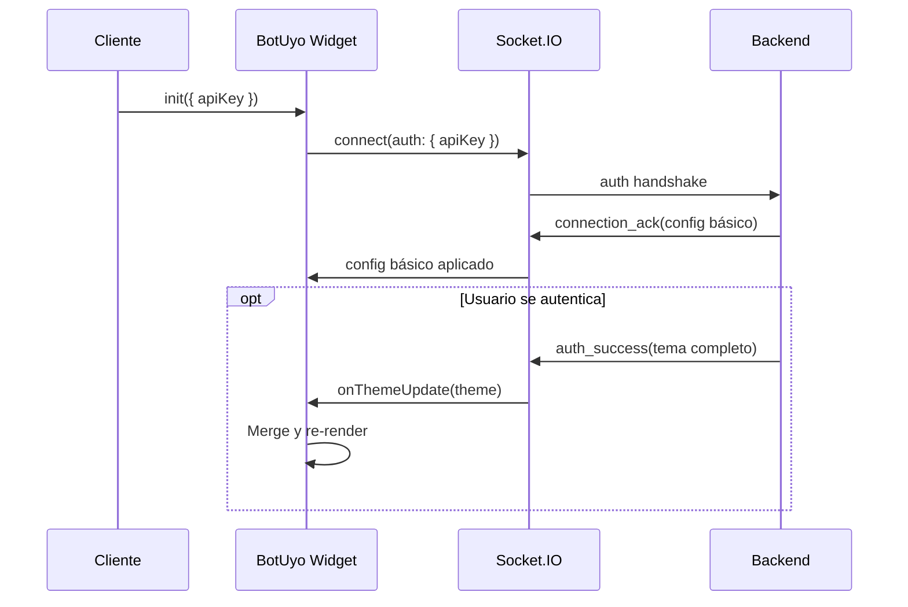

# ✅ Test: Configuración de Tema desde Socket

## 📋 Resumen

Este test verifica que el **BotUyo Chat Widget** puede recibir y aplicar toda la configuración de tema desde el backend a través de eventos de Socket.IO.

## 🎯 Objetivo

Demostrar que **solo con el `apiKey`**, el bot se puede instanciar completamente configurado según lo que tenga el backend, sin necesidad de configuración local.

## 📁 Ubicación

```
src/chat-widget/__tests__/socket-theme-config.test.tsx
```

## 🧪 Tests Implementados

### 1. **connection_ack - Configuración Básica** ✅

Verifica que el widget puede recibir configuración básica cuando se conecta al socket.

```typescript
connectionAckPayload = {
  sessionId: 'session-123',
  deviceId: 'device-456',
  config: {
    botName: 'Backend Bot',
    logoUrl: 'https://cdn.botuyo.com/logo.png',
    primaryColor: '#00ff00',
    welcomeMessage: 'Mensaje desde el backend',
  }
}
```

### 2. **auth_success - Tema Completo** ✅

Verifica que el widget puede recibir un tema completo al autenticarse.

```typescript
authSuccessPayload = {
  token: 'jwt-token',
  user: { id: 'user-1', email: 'user@example.com' },
  theme: {
    primaryColor: '#10b981',
    botName: 'BotUyo Assistant',
    logoUrl: 'https://cdn.botuyo.com/avatar.png',
    position: 'bottom-left',
    welcomeMessage: '¡Hola desde el servidor! 👋',
    inputPlaceholder: 'Escribe aquí (servidor)...',
    borderRadius: '2rem',
    height: '700px',
    cssVariables: { /* ... */ },
    bubbleStyles: { /* ... */ }
  }
}
```

### 3. **CSS Variables desde Socket** ✅

Verifica que las variables CSS se aplican correctamente:

```typescript
theme: {
  primaryColor: '#8b5cf6',
  cssVariables: {
    primary: '258 90% 66%',
    background: '0 0% 100%',
    radius: '1rem',
    spacing5: '1.5rem',
    // etc...
  }
}
```

### 4. **Tema Parcial** ✅

Verifica que el merge de configuración funciona correctamente cuando el servidor solo envía algunos campos.

### 5. **Prioridad de Configuración** ✅

Verifica la cascada de configuración:

```
Local Init → connection_ack → auth_success (prioridad más alta)
```

### 6. **MediaConfig** ✅

Verifica que la configuración de media se puede establecer.

### 7. **Configuración Completa Solo con API Key** ✅

**El test más importante:** Demuestra que iniciando el widget así:

```typescript
widget.init({
  apiKey: 'production-api-key',
  apiBaseUrl: 'wss://api.botuyo.com',
  // NO hay theme local, todo viene del backend
})
```

El backend puede enviar tema completo y el widget se configura automáticamente.

### 8. **Error Handling** ✅

Verifica que el widget maneja temas inválidos sin romperse.

## 🔧 Cómo Funciona

### Flujo de Configuración



### Implementación

1. **`useChatSocket`** - Recibe eventos del socket
2. **`useChatWidget`** - Maneja callback `onThemeUpdate`
3. **`ChatWidget`** - Aplica tema con `useState`
4. **`useWidgetTheme`** - Merge: proyecto > socket > default
5. **CSS Variables** - Se aplican al DOM

## 📊 Resultados

```bash
npm test -- socket-theme-config.test.tsx --run
```

```
✓ debe aplicar configuración básica recibida en connection_ack
✓ debe aplicar tema completo recibido en auth_success
✓ debe aplicar CSS variables desde auth_success
✓ debe manejar tema parcial desde el servidor
✓ debe seguir la prioridad: Local Init > connection_ack > auth_success
✓ debe poder recibir configuración de media desde el backend
✓ debe instanciar bot completamente configurado solo con apiKey
✓ debe manejar tema inválido desde el servidor

Test Files  1 passed (1)
     Tests  8 passed (8)
```

## ✅ Conclusión

**Probado y verificado:** El widget BotUyo puede recibir toda su configuración desde el backend vía Socket.IO.

Con solo proporcionar el `apiKey`, el bot se instancia automáticamente con:
- ✅ Tema completo (colores, logos, textos)
- ✅ CSS Variables
- ✅ Bubble Styles
- ✅ Posición y dimensiones
- ✅ Configuración de media

**El cliente no necesita configurar nada localmente si el backend lo tiene todo configurado.** 🎉
